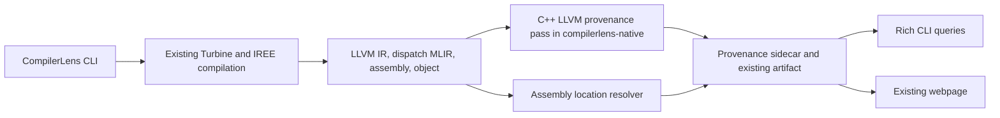

# CompilerLens finals: a complete CLI and native LLVM lineage

**Updated:** 25 September 2026

**Status:** core implementation delivered on `feature/experiments-cli`; see the implementation review below. The original design follows for context.

**Scope:** keep the existing webpage; expose its capabilities through a clear CLI; add a C++ LLVM pass and extend provenance into assembly.

**Planning assumption:** two contributors, following the existing compiler/backend and product/frontend ownership split, over five days.

## Implementation review — 25 September 2026

The CLI, native LLVM integration and existing-viewer packaging are implemented. The current
command reference is [docs/CLI.md](docs/CLI.md). The Python implementation now lives under
`compilerlens/`, with checkout compatibility imports for the older commands.

| Deliverable | Implementation |
|---|---|
| Pip package and console entrypoint | `pyproject.toml`, `setup.py`, `compilerlens/cli.py` |
| Shared capture/import service | `compilerlens/services.py`; used by web Explore and CLI |
| Persistent capture, actual inputs, resolved revisions | `run.json`, `manifest.json`, `inputs/*.npy`, content hashes; existing output directories refused |
| Inspect architecture/stages/evidence/operations/IR | Rich terminal output and JSON; uses the existing artifact schema |
| C++ New Pass Manager pass | `native/lib/Provenance.cpp`, `Plugin.cpp`, CMake; read-only LLVM traversal |
| Native integration | Private executable analyzes every captured LLVM checkpoint; explicit fallback/required/off modes |
| Complete kernel capture | All emitted dispatch kernels and LLVM modules represented, with separate comparison tracks |
| Forward/reverse tracing | `compilerlens/queries.py`, `provenance.py`; explicit origin sets, inline frames and unknown locations |
| Provenance audit | Debug, dispatch, source and exact-module counts; per-function statistics and gap reasons |
| Assembly and object addresses | `.file`/`.loc` state machine plus native LLVM object/DWARF lookup; `inspect --show objects` lists usable sections |
| Existing viewer | Bundled unchanged React app/Monaco workers; loopback server and shared API routes |
| Exact-input benchmark | NPY inputs preserve decoder causal masks; hash checks and timing reliability metadata |
| Release build | `scripts/build_release.py`; native CTest, TypeScript checking, web bundle and platform wheel |
| Optional in-IREE checkpoints | C++ hook compiled/tested and patch checked against pinned IREE source; full IREE source rebuild remains optional/unperformed |

The local release artifact is `dist/compilerlens-0.1.0-py3-none-linux_x86_64.whl`.
It has not been published to PyPI. The wheel bundles the native executable and its nonbaseline
compression libraries; users need no LLVM SDK, `opt`, Node or CMake. This first wheel is
validated on Linux x86-64/glibc 2.35/Python 3.10 and is not an audited manylinux release.

Validation completed during implementation:

- 21 Python tests covering existing architecture/LLVM behavior, fused/ambiguous source
  locations, assembly location resets, selectors, JSON/error contracts, input preservation,
  output protection and offline revision resolution.
- Native CTest: standalone/plugin agreement, unchanged normalized LLVM IR, inline frames,
  def-use/memory records, annotated IR validation, malformed input rejection, object/DWARF
  bounds and optional before/after checkpoint hook.
- Fresh matmul compilation with required native analysis and exact-input benchmarking.
- A separate environment installed the wheel and compiled matmul from outside the checkout
  with no SDK on PATH. Its executable matched NumPy matrix multiplication on the saved
  tensors (maximum absolute error 0 in that run). Dependencies were copied locally for this
  offline install check; fresh internet dependency resolution was not exercised.
- Offline tiny-GPT2 capture at commit `5f91d94bd9cd7190a9f3216ff93cd1dd95f2c7be`, sequence
  length 8: all 17 dispatch kernels, 58 stages, required native analysis succeeded.
  Optimized LLVM: 3,253 instructions / 892 source-associated; assembly: 2,462 instructions /
  1,086 source-associated. These are distinct measures, not an optimization score.
- Native object lookup on a fresh matmul object resolved a function-section byte offset to
  captured dispatch and Torch-input locations.
- Installed HTTP server exposes the saved artifact, workload index, bundled assets and API.
  Headless browser verification passed through workload selection, architecture, compiler
  workspace, Monaco and its bundled worker, with no page errors or failed requests.
- Installed local Python factory compilation with full capture and required native analysis
  succeeded; this covers the third input path and the full-log mode.

Scope decisions and remaining research:

- Snapshot source attribution is implemented. General instruction identity propagation,
  metadata preservation through arbitrary optimizations and per-machine-instruction compiler
  instrumentation are future research, as in the accepted plan.
- The plugin loads into matching LLVM `opt`; it is not loaded into the stock IREE wheel.
  See [native/iree/README.md](native/iree/README.md) for the optional source-build integration.
- Full capture retains all requested logs/resources; standard capture trims display constants
  and selects pass snapshots. Both retain authoritative exports in `_full/` for reproducibility.
- Existing browser components and visual design are unchanged.

## Accepted design

## 1. Recommended direction

Build CompilerLens into a **pip-installable compiler inspection tool with a native LLVM provenance pass**.

The main workflow should be:

```bash
pip install compilerlens

compilerlens compile sshleifer/tiny-gpt2 --out runs/gpt2
compilerlens inspect runs/gpt2
compilerlens trace runs/gpt2 --module transformer.h.0.mlp.c_fc --to asm
compilerlens view runs/gpt2
```

The terminal exposes the same model structure, stages, IR, diffs, evidence, and lineage that the webpage already presents. `view` serves the existing webpage from the installed package. No new dashboard or experiment screen is required.

The native contribution is a **real LLVM New Pass Manager analysis/reporting pass written in C++, built with CMake**. It inspects LLVM instructions, debug locations, inline chains, and def-use relationships, then feeds CompilerLens's provenance index. Assembly tracing uses emitted `.file`/`.loc` information. Object-file DWARF address mapping is the first stretch goal.

The finals story becomes:

> “CompilerLens lets you inspect a model from the command line and follow compiler-recorded provenance through MLIR, LLVM IR, and assembly. Our C++ LLVM pass exposes structured instruction provenance and audits where information is missing.”

This is compiler analysis work. It does not need to change model arithmetic or promise a speedup to be technically substantial.

| Priority | Deliverable |
|---|---|
| Must | Installable CLI exposing existing exploration capabilities |
| Must | C++ LLVM provenance/reporting pass, CMake project, loadable plugin, focused tests |
| Must | Native pass integrated into the CLI's capture/import pipeline |
| Must | Forward and reverse source/assembly lookup for supported x86 assembly dumps |
| Must | Existing webpage opens the same artifact and displays added assembly lineage |
| Stretch 1 | Object address -> DWARF location -> model-operation lookup |
| Stretch 2 | Pass invocation inside a source-built IREE LLVM optimization pipeline |
| Later | General origin propagation across transformations, machine-instruction instrumentation, optimization passes |

## 2. Exactly what parameters will users pass?

Separate **creating a run** from **querying a saved run**. Inspection commands should never recompile or download anything.

### 2.1 `compile`: model -> saved compiler run

```bash
compilerlens compile sshleifer/tiny-gpt2 \
  --seq-len 16 \
  --cpu host \
  --out runs/gpt2
```

Only the model ID is required. Print resolved defaults in the summary and record them in the manifest.

| Parameter | Proposed default | Meaning |
|---|---|---|
| `MODEL_ID` | Required for HF input | Hugging Face repository ID using the current supported text-model adapters |
| `--seq-len N` | `16` | Static sequence length used during export; not an inference-time maximum |
| `--revision REF` | Resolve current revision to a commit | Pin the model version; always save the resolved commit |
| `--cpu NAME` | `host` | CPU target for IREE's existing LLVM CPU backend |
| `--out DIR` | Fresh directory under `./compilerlens-runs/` | Persistent outputs; refuse accidental overwrite |
| `--capture standard\|full` | `standard` | Standard keeps current named stages and selected pass snapshots with display trimming; full retains all requested pass dumps and resources |
| `--offline` | Off | Use cached resources; fail clearly if the model is absent |
| `--seed N` | `0` | Reproduce generated example inputs; save actual tensors too |
| `--lineage auto\|required\|off` | `auto` | Auto runs compatible native provenance and reports fallback; required fails if it cannot run; off skips extra lineage analysis |

`--lineage` is an advanced reproducibility/troubleshooting control. A supported complete installation should use the native path automatically.

Support the existing built-in examples as mutually exclusive input sources:

```bash
compilerlens compile --example matmul --out runs/matmul
compilerlens compile --example linear_relu --out runs/linear-relu
```

A local Python factory is useful after those paths work:

```bash
compilerlens compile --python workload.py:build --out runs/local
```

Define `build()` to return `(torch_module, example_inputs)`. This executes the user's local Python code. `MODEL_ID`, `--example`, and `--python` must be mutually exclusive. HF-only arguments such as `--seq-len` must not silently alter local-factory inputs.

For the finals, compilation targets Linux x86-64 CPU. Do not expose unimplemented GPU/device choices. Keep existing advanced IREE controls in the Playground; an optional CLI allowlist can follow the core commands. No tiling/search-budget parameters are needed for this release.

### 2.2 `inspect`: the webpage's information in the terminal

```bash
compilerlens inspect runs/gpt2
compilerlens inspect runs/gpt2 --show architecture
compilerlens inspect runs/gpt2 --show stages
compilerlens inspect runs/gpt2 --show evidence
compilerlens inspect runs/gpt2 --show ops --stage torch-input
compilerlens inspect runs/gpt2 --show ir --stage llvm-optimized --lines 100:140
compilerlens inspect runs/gpt2 --show ir --stage target-asm
```

| Parameter | Meaning |
|---|---|
| `RUN` | Saved run directory or supported artifact JSON |
| `--show summary\|architecture\|stages\|evidence\|ops\|ir` | Existing view to render; default `summary` |
| `--stage ID` | Stage name/ID from `--show stages`; required when an IR/operation query needs disambiguation |
| `--module PATH` | Restrict model-aware results to an existing module mapping |
| `--lines START:END` | Restrict displayed IR to a 1-based line range |
| `--format text\|json` | Human-readable output or structured data; default `text` |

Use Rich for tables, trees, progress, and source highlighting. Keep output useful without color. Long IR can use the user's pager interactively; piped output should remain plain and unpaginated. Progress/diagnostics go to stderr so JSON stdout stays parseable.

Stage identifiers come from the run. `inspect --show stages` lists what was actually captured; do not assume every model has the same number of stages.

### 2.3 `trace`: forward and reverse provenance

```bash
# Choose an operation from inspect --show ops.
compilerlens trace runs/gpt2 --op OP_ID --to asm

# Group traces for operations owned by a model module.
compilerlens trace runs/gpt2 --module transformer.h.0.mlp.c_fc --to asm

# Concrete source selector for the existing matmul fixture.
compilerlens trace runs/matmul --source torch-input:3:10 --to asm

# Reverse lookup from an emitted assembly listing line.
compilerlens trace runs/matmul --from-stage target-asm --line 106
```

`OP_ID` is a placeholder for a saved operation identifier, not an operation-name guess. Module paths also come from `inspect --show architecture`.

| Parameter | Meaning |
|---|---|
| `--op ID` | One saved source-operation identity |
| `--module PATH` | Mapped source operations owned by a model module |
| `--source STAGE:LINE:COLUMN` | Explicit location in the run's source/IR anchor |
| `--to llvm\|asm\|all` | Destination view; default `all` |
| `--from-stage ID --line N` | Reverse lookup from a displayed IR/assembly line |
| `--format text\|json` | Human trace or complete provenance records |

Forward selectors are mutually exclusive; reverse lookup is a separate selector mode. Multiple explicit origins must remain a set instead of becoming one arbitrarily chosen owner.

Show the evidence chain:

```text
 torch.aten.matmul       torch-input:3:10
   -> dispatch source    dispatch_0.mlir:18:8
   -> LLVM locations     compiler-recorded DILocation references
   -> x86 assembly       .file/.loc associations at instruction lines

 Relationship: source attribution recorded by the compiler
 Missing links: shown explicitly
```

Several IR or machine instructions can share one location. This is not a one-to-one instruction ancestry chain.

### 2.4 Remaining commands

| Command | Example | Purpose |
|---|---|---|
| `diff` | `compilerlens diff RUN --from STAGE_A --to STAGE_B --mode text` | Existing textual/coarse semantic comparison; enforce compatible tracks |
| `import` | `compilerlens import examples/matmul --out runs/imported` | Build an artifact and run available native/assembly analyses on existing dumps without recompilation |
| `view` | `compilerlens view RUN --port 8000 --open` | Serve the bundled current webpage and selected run locally |
| `doctor` | `compilerlens doctor` | Check native analyzer, IREE, Python dependencies, versions, and supported features |

`diff --mode text|semantic` reuses current behavior; semantic means the existing operation/dialect summary, not a proof of program equivalence. `view` defaults to loopback and prints its URL; `--open` is optional for remote/headless use.

An existing-benchmark wrapper, such as `bench RUN --workers 8 --repetitions 10`, is secondary. Before exposing existing benchmarking more broadly, fix its constant-input substitution so decoder attention masks retain their intended values. Do not expand this release into autotuning.

The ordinary user needs four commands:

```text
compile MODEL --out RUN       create it
inspect RUN                  understand what was captured
trace RUN --op ID --to asm    follow an operation
view RUN                     inspect it in the existing webpage
```

## 3. What the C++ LLVM pass should actually do

### 3.1 Implement one substantial pass first

Use **`compilerlens-provenance`** as the name of a module-level New Pass Manager reporting pass. Share its implementation with the packaged native analyzer.

For each LLVM instruction, emit:

- snapshot/module identity, function, basic block, and instruction ordinal;
- opcode, result type, operand instruction references, and relevant call information;
- whether it reads/writes memory and basic vector-type information;
- available `DebugLoc`/`DILocation` information: file, directory, line, column, discriminator, scope, and inline call chain;
- whether the location is absent, has line zero, names an external helper, or resolves to a captured dispatch source;
- information needed to connect the instruction to a stable display location and compiler-produced source anchor.

Use LLVM APIs such as `Module`, `Function`, `Instruction`, `DebugLoc`, `DILocation`, `DIScope`, `DIFile`, and operand/use traversal. This replaces fragile textual metadata interpretation for the native path.

The pass should be **read-only**, return `PreservedAnalyses::all()`, and leave the executable-producing module unchanged. An analysis/reporting pass is a real compiler pass; changing arithmetic is not a prerequisite.

### 3.2 Produce a useful provenance audit

Report distinct measures:

1. Instructions with compiler debug locations.
2. Instructions whose locations resolve to a captured dispatch source.
3. Instructions whose dispatch source resolves to a Torch-input anchor.
4. Instructions whose anchor has a supported model-module mapping.
5. Reasons for the remaining gaps.

Separate dispatch functions from runtime/library helpers. An increase in unlocated instructions after library linking is not evidence that model lineage was lost.

Analyze the existing `codegen`, `linked`, and `optimized` LLVM snapshots. Report coverage changes between checkpoints, but do not identify a specific destructive pass unless that pass was actually instrumented in the same compiler execution.

Instruction IDs must be snapshot-local: module-content hash, function, block, and ordinal. Similarly named instructions or equal source locations do not establish persistent identity across optimization.

### 3.3 Separate data dependencies from provenance

The native pass can expose real def-use edges. They answer “which LLVM values feed this instruction?” They do not establish which source operation created it.

Do not fill missing provenance by taking operand-origin unions and presenting them as compiler-recorded ownership. Values contribute to later operations, and fusion, rematerialization, common-subexpression elimination, and inlining complicate ownership.

Arbitrary `!compilerlens.origin` metadata is not guaranteed to survive LLVM optimization or machine-code emission. A general metadata-propagation scheme is a later research task.

### 3.4 Preserve identity for reliable source joins

Keep full file identities, columns, inline chains, and explicit origin sets in a native sidecar. Do not key everything by bare line numbers or dispatch basenames.

The existing architecture mapping remains the bridge from Torch operations to model modules. An LLVM pass cannot reconstruct PyTorch ownership from stripped LLVM IR alone.

For relocated files, use the run manifest and unique aliases. If captured files share a basename, resolve by full identity/hash or report ambiguity. Never join a C++ helper's line 18 to Torch-input line 18 just because the numbers agree.

Distinguish **debug source lines** from **physical `.ll` display lines**. A practical solution is for the native analyzer to emit an annotated LLVM text view with instruction-ID comments using LLVM's assembly-printing support. Ingest maps those markers to display lines; preserve the original dump separately. This avoids brittle matching of multiline instructions.

## 4. How the pass integrates with IREE

There are three distinct integrations. Describe them accurately in code, documentation, and the presentation.

### A. Default release: native analysis of actual IREE outputs



The Python package invokes a private executable, `compilerlens-native`. It parses IREE's LLVM output and runs the same New Pass Manager pass used by the developer plugin, writing versioned JSON for ingest.

This is a native LLVM pass integrated into CompilerLens's pipeline. It is not injected into the IREE wheel's optimizer. It analyzes actual captured IREE output and does not re-optimize a substitute program.

A private native executable also avoids requiring users to find a compatible system `opt` or load C++ code into IREE's process.

### B. Developer plugin: conventional LLVM integration

Build `CompilerLensPasses.so` and load it with the `opt` from the same LLVM build:

```bash
/path/to/llvm/bin/opt \
  -load-pass-plugin=build/native/CompilerLensPasses.so \
  -passes=compilerlens-provenance \
  -disable-output \
  run/llvm/module.optimized.ll > provenance.json
```

The pass name, CMake target, registration callback, and tests provide visible compiler implementation. JSON must be the only stdout output; `-disable-output` prevents bitcode from being mixed into it.

A plugin built against LLVM 22 is not automatically safe inside LLVM 23. Match the plugin to its host's build/API/ABI settings. Parsing another version's textual IR in a separate process is a different compatibility question that also requires testing.

### C. Optional invocation inside source-built IREE

The pinned IREE source constructs its real LLVM optimization pipeline here:

```text
compiler/plugins/target/LLVMCPU/LLVMIRPasses.cpp
  runLLVMIRPasses(...)
  PassBuilder
  buildPerModuleDefaultPipeline(...)
```

Link the pass's reusable core and insert reporting passes around that actual pipeline. Cover O0 too: the current implementation conditionally skips building the optimization pipeline at O0.

A later extension can register `PassInstrumentationCallbacks` for before/after-pass coverage snapshots. This reports observed coverage changes; per-instruction loss attribution still needs careful identity handling.

Gate this on an available compatible IREE source/build tree and build time. The pip release should not require every user to rebuild IREE.

**Do not advertise `iree-compile --load-pass-plugin=...` as working integration.** The inspected binary does not expose that standard `opt` option, and the pinned LLVM pipeline does not register external pass-plugin callbacks. Generic `--load` and IREE compiler plugins are not equivalent to LLVM New Pass Manager registration.

## 5. Concrete C++ and CMake structure

```text
native/
  CMakeLists.txt
  include/compilerlens/Provenance.h
  lib/Provenance.cpp          # LLVM traversal, locations, audit
  lib/Plugin.cpp              # pass registration
  tools/compilerlens-native.cpp
  tests/
    locations.ll
    inline-chain.ll
    missing-debug.ll
    duplicate-filenames.ll
    multiline-instruction.ll
    check_reports.py
```

For the first plugin milestone, this CMake structure is sufficient:

```cmake
cmake_minimum_required(VERSION 3.20)
project(CompilerLensNative LANGUAGES C CXX)

find_package(LLVM REQUIRED CONFIG)
set(COMPILERLENS_LLVM_MAJOR 22 CACHE STRING "Validated LLVM major")
if(NOT LLVM_VERSION_MAJOR EQUAL COMPILERLENS_LLVM_MAJOR)
  message(FATAL_ERROR "Use the validated LLVM development toolchain")
endif()

list(APPEND CMAKE_MODULE_PATH "${LLVM_CMAKE_DIR}")
include(AddLLVM)
set(CMAKE_CXX_STANDARD 17)
set(CMAKE_CXX_STANDARD_REQUIRED ON)
include_directories(SYSTEM ${LLVM_INCLUDE_DIRS})
include_directories("${CMAKE_CURRENT_SOURCE_DIR}/include")
add_definitions(${LLVM_DEFINITIONS})

add_llvm_pass_plugin(CompilerLensPasses
  lib/Plugin.cpp
  lib/Provenance.cpp
)

include(CTest)
# Add fixture/report checks using this LLVM build's opt.
```

The private executable links the same provenance implementation with LLVM `Core`, `IRReader`, `Analysis`, `Passes`, and `Support`. Use LLVM's CMake helpers to preserve RTTI/exception and link settings. Add `Object`/`DebugInfoDWARF` when implementing address lookup. Install the executable into the native wheel's private binary directory.

Registration is ordinary New Pass Manager code:

```cpp
#include "compilerlens/Provenance.h"
#include "llvm/Passes/PassBuilder.h"
#include "llvm/Plugins/PassPlugin.h"  // Validated LLVM 22 layout.

extern "C" LLVM_ATTRIBUTE_WEAK llvm::PassPluginLibraryInfo
llvmGetPassPluginInfo() {
  return {
    LLVM_PLUGIN_API_VERSION, "CompilerLensPasses", "0.1.0",
    [](llvm::PassBuilder &PB) {
      PB.registerPipelineParsingCallback(
        [](llvm::StringRef Name, llvm::ModulePassManager &MPM,
           llvm::ArrayRef<llvm::PassBuilder::PipelineElement>) {
          if (Name != "compilerlens-provenance") return false;
          MPM.addPass(compilerlens::ProvenancePass());
          return true;
        });
    }
  };
}
```

Older examples use `llvm/Passes/PassPlugin.h`. The available LLVM 22.1.8 uses `llvm/Plugins/PassPlugin.h` and plugin API version 2. Pin to the tested toolchain instead of copying arbitrary tutorial headers.

```bash
cmake -S native -B build/native -G Ninja \
  -DLLVM_DIR=/path/to/llvm/lib/cmake/llvm \
  -DCMAKE_BUILD_TYPE=Release
cmake --build build/native --parallel 2
ctest --test-dir build/native --output-on-failure
```

Compiler selection and C++ standard-library discovery must be explicit on machines with multiple toolchains. The local smoke test needed Clang's `--gcc-install-dir=/usr/lib/gcc/x86_64-linux-gnu/11`; that is a local build setting, not a flag to hardcode for everyone.

## 6. Extending lineage through assembly

### 6.1 First deliverable: emitted assembly listing

The repository's `.s` files already contain records such as:

```asm
.file 1 "dumps" "module_main$async_dispatch_0.mlir"
.loc 1 18 8
    ...
    vfmadd231ps ...
```

The join is:

```text
assembly instruction line
  -> current .loc file/line/column
  -> captured dispatch MLIR line
  -> original loc(...) in that dispatch dump
  -> Torch-input operation
  -> model module, where ownership is available
```

The current `parse_asm()` discards these directives. Extend it with a conservative location-state parser and feed associations into the existing lineage builder.

Required details:

- Support actual numbered `.file` forms emitted by the pinned x86 toolchain, including directory/name forms and escaped filenames.
- Carry `.loc` through ordinary instructions until it changes.
- Treat line zero as unavailable and clear the preceding source association.
- Reset state at relevant function/section boundaries; avoid assigning the previous function's last location to a new prologue.
- Do not clear valid locations at ordinary internal labels.
- Preserve available discriminator/statement metadata in the sidecar.
- Exclude directives, data, labels, and alignment padding from mnemonic-level coverage.
- Report unsupported syntax instead of guessing.

An inherited `.loc` is the assembler's source association. It does not prove each machine instruction has an independent corresponding LLVM `!dbg` attachment. LLVM-instruction and assembly coverage can therefore differ.

### 6.2 Stretch: actual object-file addresses

LLVM IR passes run before instruction selection/register allocation and cannot see final code addresses. Address tracing needs a separate object/debug-info reader.

Preserve the **actual object emitted by IREE**. Use LLVM Object/DWARF APIs, or validated tools during prototyping, to join:

```text
(object identity, section, address range)
  -> DWARF line-table row / inline frames where present
  -> dispatch MLIR source
  -> source operation and model module
```

Relocatable `.o` files can have address zero in several sections. Preserve section identity and relocation handling. Linked objects have their own addresses; runtime addresses additionally need the correct load mapping. Do not reuse `.o` offsets as VMFB/runtime addresses.

DWARF rows define ranges, usually ending at the next row within a sequence. Handle `end_sequence`, line zero, duplicate-address rows, and uncovered ranges. Cross-check supported cases with `llvm-dwarfdump` and `llvm-objdump`.

A later command could be:

```bash
compilerlens trace RUN --object OBJECT_ID --section SECTION --address 0xOFFSET
```

This must not delay the LLVM pass and `.s` tracing. Do not regenerate assembly with an unrelated `llc` and present it as IREE's emitted assembly.

## 7. Use the existing webpage

Keep the React screens, navigation, panes, and styling. Retain browser artifact version 0.7 initially.

The schema already supports assembly stages, instruction line numbers, `Operation.source_loc`, lineage highlight maps, evidence, gap notes, and artifact notes. Populate those fields from the new backend data.

For a unique resolved origin, set `source_loc`. For multiple explicit origins, retain the set in the sidecar and let the lineage builder add the operation's display line under each supported source anchor without inventing one scalar owner. Leave unresolved associations absent.

Browser source-line grouping is coarser than the CLI's file/line/column identities. Explain that limit through existing notes. Full native records remain in `provenance.json`, available to CLI queries without a frontend schema migration.

Packaging requires build/server plumbing:

1. Bundle existing Vite production assets and Monaco workers.
2. Serve `/artifacts/index.json` and the selected run's artifact from Python.
3. For installed builds, set the existing `VITE_SANDBOX_API` override to an empty string so the existing client uses same-origin routes. Mount API routes before static fallback.
4. Delegate capture/compile API calls to shared services using configurable run paths.
5. Build release assets without copying the entire generated `frontend/public/artifacts` collection into the wheel.

`view RUN` can open the current landing page with that run listed. New routing, selected-operation deep links, and new UI controls are unnecessary for the finals.

## 8. Pip packaging, including the native component

### 8.1 One primary installation

For the finals, make `pip install compilerlens` the complete supported installation. Include Python CLI/compiler dependencies and a prebuilt native analyzer for the advertised platform. A separate lightweight viewer can follow later.

Internally, use two distributions if useful:

```text
compilerlens                 Python CLI, ingest, adapters, bundled webpage
  depends on:
compilerlens-native          private executable and native runtime needs
```

End users should not need LLVM headers, CMake, Ninja, or system `opt`. Developers building the native package from source need those dependencies. Publish supported platform wheels and test installation using the binary native artifact.

Start with **Linux x86-64 / Python 3.10**. Broader platforms follow actual build and installation tests.

### 8.2 Compatibility strategy

Installed IREE package 3.11.0 reports compiler commit `e4a3b0405d7d23554da26403658d0e8c3c5ecf25` and LLVM 23.0.0git. The development installation used for the pass smoke test is LLVM 22.1.8.

LLVM 22.1.8 successfully parsed the tested IREE textual dumps. This does not establish general forward IR compatibility. Pin and test the exact producer/analyzer combination. Reject unsupported IR or rejected debug information; do not strip unfamiliar attributes just to make parsing succeed.

The standalone analyzer does not share an ABI with IREE. The plugin must be loaded by its matching LLVM 22.1.8 `opt`; an in-IREE build needs IREE's own exact LLVM dependency/build settings.

Version the JSON protocol. Record producer compiler, analyzer LLVM, pass version, and input hashes. Reject incompatible sidecar versions clearly.

### 8.3 Release work

- Add `pyproject.toml`, the console entry point, and a `compilerlens` namespace. Avoid installing generic top-level `models`, `backend`, and `ingest` packages.
- Reuse current modules under that namespace; make the import/path move early and avoid unrelated refactoring.
- Share capture/artifact services between CLI and FastAPI.
- Read installed assets through `importlib.resources`; write runs to `--out`, never into `site-packages`.
- Keep direct dependency metadata separate from the pinned development environment snapshot.
- `requirements.txt` uses a CPU PyTorch extra index. Package metadata cannot copy that pip index directive. Test the default resolver and document CPU-only preinstallation if needed. The complete install may be large; do not promise a small download.
- Build native wheels in a suitable Linux release environment. Inspect dependencies and RPATHs; do not ship references to this machine's `/pkg/qct/software/...` paths.
- Include required LLVM/third-party license notices and native runtime libraries in the release process.
- Check package names on Day 1 and produce local installable wheels even if publication is pending. Advertise public pip installation only once the distributions exist.

## 9. Run layout and implementation map

```text
runs/run-id/
  manifest.json               versions, commands, model, target, input identities
  artifact.json               existing browser contract
  provenance.json             richer native/assembly relationships
  source/                     source anchor and module ownership
  mlir/                       existing stage captures
  llvm/                       original .ll, .s, dispatch source, retained .o
  native/                     annotated views and per-snapshot pass reports
  inputs/                     actual example tensors
  logs/
```

Preserve exact dispatch-source text referenced by LLVM and assembly. Reformatting/trimming that authoritative file can change line numbers and corrupt joins. Separate display copies can be trimmed with explicit mapping back to authoritative coordinates.

| Existing location | Planned change |
|---|---|
| `scripts/compile_hf_model.py` | Put orchestration behind `compile`; generate artifacts automatically |
| `backend/compiler/runner.py` | Capture debug artifacts; invoke native analyzer after compilation |
| `native/` | New C++ pass, plugin, native driver, CMake, fixtures |
| `ingest/llvm_parser.py` | Add `.file`/`.loc` associations; retain current metadata parser as explicit fallback |
| `ingest/build.py` | Join native and assembly reports into existing stages/evidence |
| `ingest/lineage.py` | Validate source identities and accept explicit origin sets while retaining browser-compatible output |
| `ingest/workloads/generated.py` | Retain actual executable/function/file relationships for traces rather than using an unrelated representative kernel |
| `models/architecture.py` | Reuse exact ownership capture; local-factory support only if time permits |
| `backend/api/` | Serve packaged assets/runs; share capture services |
| `frontend/` | Release build configuration only; existing UI and interactions remain |

Hash authoritative files. Type relationships explicitly: compiler source association, inline call site, data dependency, or unresolved. Do not use instruction IDs as cross-snapshot identities.

## 10. What was actually tested for this direction

These were feasibility checks in temporary files, not completed product features:

1. **CMake/plugin build worked.** A small C++ New Pass Manager reporting pass was built with LLVM/Clang 22.1.8, CMake 3.31.5, and Ninja. It exports `llvmGetPassPluginInfo`, registers a module pass, and returns `PreservedAnalyses::all()`.
2. **Plugin loading worked.** Matching `opt` loaded it and ran it on matmul and tiny GPT-2 optimized LLVM dumps.
3. **Real instruction metadata was accessible.** The small audit counted 1,697 instructions / 108 with nonzero debug lines in the existing matmul optimized dump, and 3,702 / 1,492 in tiny GPT-2. These are whole-dump instruction/debug counts, not model-origin coverage or lineage-quality scores.
4. **Fresh IREE dumps were readable.** The pass parsed newly captured matmul codegen, linked, and optimized textual LLVM files.
5. **Assembly provenance exists.** The existing matmul's `vfmadd231ps` at listing line 106 resolves through dispatch source line 18 to Torch-input `3:10` in a small exploratory resolver. This is a checked example, not validated general assembly coverage.
6. **Object DWARF exists.** Fresh IREE compilation with executable debug level 3 and CPU debug symbols produced an object and linked executable with readable DWARF line tables. LLVM tools resolved addresses to dispatch source.
7. **The IREE integration boundary was checked.** Its exact LLVM pipeline source constructs its own `PassBuilder` and does not automatically install external pass-plugin callbacks.

Temporary code/build/artifacts are under `/tmp/compilerlens-native-plan-check`. No C++ product or frontend implementation was added to the repository during planning. Portable wheels, the full provenance pass, CLI, and general assembly resolver remain implementation work.

## 11. Five-day schedule

Assume 6–7 focused hours per contributor per day. Keep one native pass plus its CLI adapter on the critical path, and reserve the final afternoon for rehearsal.

| Day | Compiler/native owner | CLI/package owner | Required result |
|---|---|---|---|
| **1: Interfaces and builds** | Reproduce pass build; define JSON; validate IR compatibility; native-driver skeleton | Freeze CLI help/arguments; namespace/import move; capture/import and summary; installed viewer skeleton | C++ pass runs on real IR; installed CLI captures/imports a run |
| **2: Lineage bridge** | Debug/inline/file records; source joins; assembly location state; negative fixtures | Rich architecture/stages/evidence/IR output; manifest; native invocation and diagnostics | Known matmul source traces to emitted assembly |
| **3: Complete native workflow** | Native executable sharing pass core; stable display mapping; audit reasons; reverse lookup | Trace, diff, doctor, view; native wheel assembly; enrich existing artifact schema | Native CLI and unchanged webpage consume the same run |
| **4: Validate and package** | Second workload; unknown/ambiguous/inline cases; LLVM-tool comparisons; address stretch only if core is green | Clean install outside checkout; runtime dependency checks; offline assets; browser regression | Installable wheels and reproducible two-workload demo |
| **5: Freeze and present** | Fix blocking provenance issues; freeze artifacts/toolchain | Final help/examples; offline demo; local wheel backup; recording/rehearsal | Repeatable CLI -> C++ pass evidence -> assembly -> current webpage demo |

### Scope gates

- **Day 1:** prove the native-driver skeleton can be packaged without the machine's LLVM paths. Native portability cannot wait until Day 5.
- **Day 2:** finish `.s` tracing before object-address lookup. Available DWARF data does not make the complete address feature mandatory.
- **Day 3:** if an IREE source build is not already working, ship standalone native-pass integration and matched-`opt` plugin. Document the internal hook without claiming it shipped.
- **Day 4:** cut local-factory support, object-address lookup, and cosmetic CLI work before native tests, source-identity checks, or wheel tests.
- **Solo version:** HF/built-in capture, summary/IR inspection, one native reporting pass, one assembly trace, existing browser. Reduce optional CLI views and stretch features.

## 12. Tests and acceptance criteria

### Native pass

- Check file/line/column/inline-chain reports against LLVM fixtures.
- Cover missing metadata, line zero, helper scopes, duplicate basenames, and shared locations.
- Check def-use edges without converting them into origin claims.
- Test multiline instructions and exact displayed-IR mapping.
- Compare normalized IR before/after reporting to confirm no module mutation.
- Reject incompatible IR/debug information and analyzer protocols explicitly.

### Assembly/source resolver

- Cover numbered `.file`, directory/name forms, inheritance, line-zero resets, internal labels, and function boundaries.
- Cover multiple files/functions, missing source files, and ambiguous aliases.
- Verify the existing matmul FMA association and a tiny-model case.
- Check forward/reverse lookup agreement.
- For optional address lookup, check section-aware ranges and `end_sequence` against LLVM tools.

### Package and product

- Install wheels in a new environment outside the repo with no project `PYTHONPATH` and no system LLVM on PATH.
- Run capture/import, inspect, trace, and view from that installation.
- Confirm JSON is uncontaminated by progress text and saved runs survive process restart.
- Open old and enriched artifacts in the existing webpage, including assembly highlighting.
- Confirm offline static assets/Monaco and cached-model compilation.
- Record capture time, analysis time, and artifact size. Make no performance-improvement claim for an analysis feature.

Success means the complete chain works with honest gaps. Lower coverage after removing false associations can be a correctness improvement. “100% lineage” is not a release criterion.

## 13. Why this is credible compiler work

The implementation provides:

1. A conventional LLVM pass, build targets, registration, and tests.
2. Native instruction/metadata traversal and a versioned provenance representation.
3. Def-use analysis distinguished from source attribution.
4. A join through dispatch MLIR into model ownership.
5. Assembly/debug-info handling, gap audits, and false-link regression fixtures.
6. A compatible native component packaged as a usable developer tool.

LLVM already supplies source debugging, symbolization, and debug-info validation. We are not inventing DWARF or claiming locations prove semantic equivalence. CompilerLens contributes the model-to-compiler bridge, combined provenance queries, and consistent CLI/web artifact workflow.

A location-auditing **MLIR pass** or **machine-function analysis pass** could follow. MLIR exposes richer fused/callsite locations earlier; machine passes see post-selection instructions. Both add build/pipeline integration work. Start with the tested LLVM pass and assembly evidence, then expand where measured gaps justify it.

## 14. Finals demonstration

Use roughly six minutes:

1. Show `--help`, `doctor`, and the four-command workflow using cached dependencies.
2. Inspect model architecture, stages, and a source operation in terminal output.
3. Briefly show CMake, pass registration, and the LLVM APIs used in the C++ implementation.
4. Trace a matmul source through dispatch/LLVM evidence to an emitted FMA instruction.
5. Reverse-query that assembly line; show an unavailable/ambiguous case handled correctly.
6. Run `view RUN` and inspect the same evidence through the existing webpage.

If address tracing is complete, add it as the technical extension. If in-IREE invocation is incomplete, accurately describe the shipped path as a native LLVM pass over IREE's captured IR, integrated into CompilerLens.

Suggested pitch:

> “We made CompilerLens installable and scriptable, added a C++ LLVM provenance pass, and extended source attribution into assembly. The CLI and webpage inspect the same compiler evidence.”

## 15. References

Reviewed [README.md](README.md), [architecture notes](../dummy/ARCHITECTURE-NOTES.md), [original design](../dummy/DESIGN-DOC.md), the compiler runner, architecture capture, LLVM/assembly parsers, lineage builder, artifact schema, frontend clients, and generated matmul/tiny-model dumps.

External references:

- [Writing an LLVM New Pass Manager pass](https://llvm.org/docs/WritingAnLLVMNewPMPass.html)
- [LLVM source-level debugging](https://llvm.org/docs/SourceLevelDebugging.html)
- [Updating LLVM debug information](https://llvm.org/docs/HowToUpdateDebugInfo.html)
- [llvm-dwarfdump](https://llvm.org/docs/CommandGuide/llvm-dwarfdump.html)
- [llvm-symbolizer](https://llvm.org/docs/CommandGuide/llvm-symbolizer.html)
- [Pinned IREE LLVM pipeline](https://github.com/iree-org/iree/blob/e4a3b0405d7d23554da26403658d0e8c3c5ecf25/compiler/plugins/target/LLVMCPU/LLVMIRPasses.cpp)
- [Pinned IREE LLVM CPU target/artifact emission](https://github.com/iree-org/iree/blob/e4a3b0405d7d23554da26403658d0e8c3c5ecf25/compiler/plugins/target/LLVMCPU/LLVMCPUTarget.cpp)
- [Pinned IREE CPU target options](https://github.com/iree-org/iree/blob/e4a3b0405d7d23554da26403658d0e8c3c5ecf25/compiler/plugins/target/LLVMCPU/LLVMTargetOptions.cpp)

Installed compiler help, LLVM headers, an actual native build, and emitted artifacts established local feasibility. Live documentation, arbitrary LLVM tutorials, and the installed IREE wheel do not necessarily expose interchangeable APIs.
