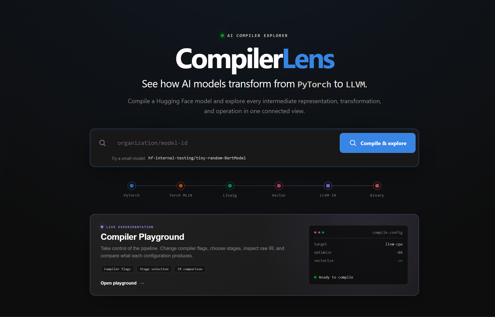
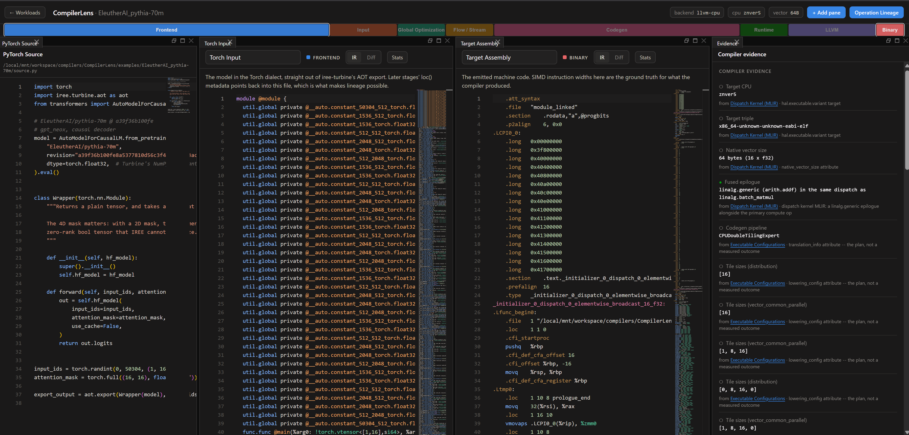
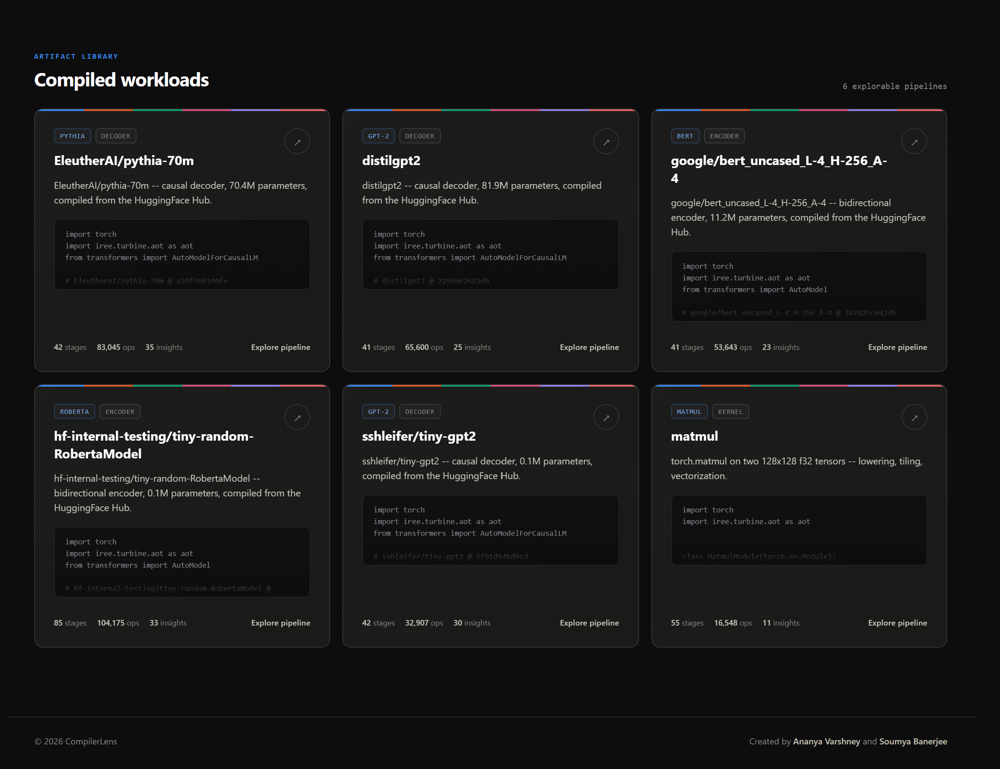

# CompilerLens

CompilerLens is an interactive explorer for AI compiler pipelines. It compiles a PyTorch or
Hugging Face model through IREE and presents the resulting Torch, MLIR, LLVM IR, and x86-64
stages in one navigable interface.

<p align="center">
  
</p>

<p align="center"><em>Search and compile Hugging Face models, follow the lowering path, or experiment in the Compiler Playground.</em></p>

## Table of Contents

- [Key Capabilities](#key-capabilities)
- [System Architecture and Repository Layout](#system-architecture-and-repository-layout)
- [System Requirements](#system-requirements)
- [Installation](#installation)
- [Running CompilerLens Locally](#running-compilerlens-locally)
- [Compiling Models from the Web Interface](#compiling-models-from-the-web-interface)
- [Supported Model Architectures](#supported-model-architectures)
- [Command-Line Model Compilation](#command-line-model-compilation)
- [Compiler Playground and Benchmarking](#compiler-playground-and-benchmarking)
- [Validation and Testing](#validation-and-testing)
- [Troubleshooting](#troubleshooting)
- [Contributions](#contributions)
- [Citation](#citation)
- [License](#license)

## Key Capabilities

- A searchable timeline of compiler stages and passes
- Side-by-side textual and semantic diffs
- Compiler evidence linked directly to the IR that produced it
- Operation lineage from framework-level operations to lower-level representations
- A landing-page search flow that compiles a Hugging Face model and adds it as a workload
- A Compiler Playground for changing selected compiler options and benchmarking the result

## System Architecture and Repository Layout

CompilerLens separates model acquisition, compilation, artifact construction, and
visualization. The normalized artifact is the contract between the Python compiler pipeline and
the TypeScript frontend.

### End-to-end data flow

```mermaid
%%{init: {"theme":"base","themeVariables":{"background":"#080c12","primaryTextColor":"#e5e7eb","lineColor":"#64748b","fontFamily":"ui-monospace, SFMono-Regular, Menlo, monospace","clusterBkg":"#0b111b","clusterBorder":"#334155","edgeLabelBackground":"#111827"},"flowchart":{"curve":"linear","nodeSpacing":36,"rankSpacing":48}}}%%
flowchart TB
    subgraph Entry["1 · User entry points"]
        direction LR
        Search["Landing page<br/>Search and compile a model"]
        Controls["Compiler Playground<br/>Choose model, stage, and flags"]
    end

    subgraph Service["2 · FastAPI orchestration"]
        direction LR
        Explore["Persistent exploration job<br/>POST /explore · poll GET /compile/{id}"]
        Compile["Temporary compilation job<br/>POST /compile · poll GET /compile/{id}"]
    end

    subgraph Preparation["3 · Shared model preparation and export"]
        direction TB
        Resolve["Hugging Face Hub or local cache<br/>Resolve revision and architecture"]
        Wrap["PyTorch model adapter<br/>Load float32 weights · wrap output · build inputs"]
        Export["IREE Turbine AOT<br/>Export the model to Torch MLIR"]
        Mode{"Compilation mode"}

        Resolve --> Wrap --> Export --> Mode
    end

    subgraph Compilation["4 · Compilation, storage, and visualization"]
        direction LR

        subgraph Persistent["Persistent exploration path"]
            direction TB
            Capture["Full IREE pipeline capture<br/>iree-compile + iree-opt"]
            Dumps[("Compiler dump directory<br/>examples/{model}/<br/>MLIR · pass logs · LLVM IR · assembly")]
            Analyze["Artifact construction<br/>Parse · normalize · diff · evidence · lineage"]
            Artifacts[("Static artifact store<br/>frontend/public/artifacts/<br/>model JSON · index.json")]
            Explorer["Exploration interface<br/>Artifact library · Workspace · Lineage"]

            Capture --> Dumps --> Analyze --> Artifacts --> Explorer
        end

        subgraph TemporaryPath["Compiler Playground path"]
            direction TB
            Selected["Focused IREE compilation<br/>Compile only the requested stage"]
            Temporary[("Temporary work directory<br/>Selected MLIR + executable VMFB")]
            JobState[("In-memory job state<br/>Status · signals · output paths")]
            Benchmark["Optional runtime benchmark<br/>iree-benchmark-module"]
            Results["Playground interface<br/>Generated IR · signals · timing"]

            Selected --> Temporary --> JobState --> Results
            Temporary -.-> Benchmark -.-> JobState
        end
    end

    Search --> Explore
    Controls --> Compile
    Explore --> Resolve
    Compile --> Resolve
    Mode -->|Full pipeline| Capture
    Mode -->|Selected stage| Selected

    class Search,Controls,Explorer,Results ui
    class Explore,Compile api
    class Resolve,Wrap model
    class Export,Capture,Selected,Benchmark compiler
    class Mode decision
    class Dumps,Artifacts persistent
    class Temporary,JobState transient
    class Analyze analysis

    classDef ui fill:#10243e,stroke:#4f9cf9,color:#edf6ff,stroke-width:2px
    classDef api fill:#24183d,stroke:#9b87f5,color:#f4f0ff,stroke-width:2px
    classDef model fill:#332315,stroke:#f59e0b,color:#fff7ed,stroke-width:2px
    classDef compiler fill:#321827,stroke:#ec6fa5,color:#fff1f7,stroke-width:2px
    classDef decision fill:#202938,stroke:#94a3b8,color:#f8fafc,stroke-width:2px
    classDef persistent fill:#0f2b24,stroke:#34d399,color:#ecfdf5,stroke-width:2px
    classDef transient fill:#2c230e,stroke:#eabf4f,color:#fffbeb,stroke-width:2px
    classDef analysis fill:#0d2931,stroke:#35b9c9,color:#ecfeff,stroke-width:2px

    style Entry fill:#0b172a,stroke:#27496f,stroke-width:1px,color:#bfdbfe
    style Service fill:#17122b,stroke:#4c3b78,stroke-width:1px,color:#ddd6fe
    style Preparation fill:#24170f,stroke:#70451d,stroke-width:1px,color:#fed7aa
    style Compilation fill:#090e16,stroke:#334155,stroke-width:1px,color:#cbd5e1
    style Persistent fill:#0a1e1a,stroke:#1f6f58,stroke-width:1px,color:#a7f3d0
    style TemporaryPath fill:#1d180b,stroke:#735d16,stroke-width:1px,color:#fde68a
```



Blue nodes are browser surfaces, violet nodes are API orchestration, orange nodes are shared
model preparation, pink nodes are compiler execution, green nodes are durable files, and amber
nodes are temporary state. Both API routes converge on the same model preparation code before
branching into either complete artifact capture or fast selected-stage compilation.

The persistent landing-page flow performs the following steps:

1. `models/detect.py` resolves the Hugging Face revision and determines the supported model
   signature.
2. `models/hf_wrapper.py` loads the model, normalizes its inputs, and exposes a traceable tensor
   output.
3. `backend/compiler/runner.py` exports the PyTorch module through Turbine and invokes
   `iree-compile` and `iree-opt` to capture the lowering pipeline.
4. The raw stage, pass, LLVM IR, and assembly dumps are written under `examples/<model>/` for
   persisted compilations.
5. `ingest/` parses those dumps and derives stage metadata, diffs, compiler evidence, and
   operation lineage.
6. The resulting artifact and workload index are written to `frontend/public/artifacts/`.
7. The React frontend loads that artifact and renders it through Monaco Editor and Golden
   Layout.

The Compiler Playground deliberately stops short of artifact construction. It exports the same
wrapped model, compiles only the requested stage into a temporary directory, retains a VMFB for
optional benchmarking, and exposes status, signals, IR paths, and timing through in-memory job
state. These Playground jobs disappear when the API process restarts; persisted exploration
artifacts do not.

### Interactive pipeline workspace

Each compiled workload opens as a configurable workspace. Developers can inspect the original
PyTorch source beside any captured IR stage, follow the phase rail from frontend lowering to
binary output, compare representations, and trace compiler evidence back to the stage that
produced it.

<p align="center">
  
</p>

<p align="center"><em>The Pythia 70M pipeline viewed across framework source, compiler IR, target assembly, and evidence.</em></p>

### Artifact contract

Each workload is represented by one normalized JSON document containing:

- Model and compilation metadata
- Ordered compiler stages with complete IR text
- Operation summaries and histograms
- Track-aware stage diffs
- Compiler evidence with source-stage references
- Source-to-stage operation lineage
- Explicit notes for incomplete or unavailable compiler data

The Python schema is defined in `ingest/schema.py` and mirrored by
`frontend/src/api/artifact.ts`. A schema change must update both definitions and increment the
artifact version.

### Runtime modes

| Mode | Entry point | API required | Persistence | Primary purpose |
|---|---|---:|---|---|
| Static explorer | `npm run artifact` + `npm run dev` | No | Generated artifact files | Explore existing compiler dumps |
| Web model search | Model search field on the landing page | Yes | Dumps and artifact are retained | Add a Hugging Face model end to end |
| Compiler Playground | **Open the Compiler Playground** | Yes | In-memory job and temporary files | Test compiler options and selected stages |
| Command-line compilation | `scripts/compile_hf_model.py` | No | Dumps under `examples/` | Scriptable or offline compilation |

### Repository layout

```text
CompilerLens/
├── backend/
│   ├── api/
│   │   ├── app.py               Compilation, exploration, artifact, and benchmark endpoints
│   │   └── run_server.py        API startup and toolchain validation
│   ├── compiler/
│   │   └── runner.py            Turbine export and multi-stage IREE compilation
│   └── measure/                 Runtime benchmarking and controlled comparisons
├── models/
│   ├── detect.py                Hugging Face metadata and architecture detection
│   ├── hf_wrapper.py            Traceable model wrapper and example inputs
│   └── prefetch.py              Model caching for offline demonstrations
├── ingest/
│   ├── build.py                 Artifact and landing-page index generation
│   ├── schema.py                Python definition of the artifact contract
│   ├── lineage.py               Source-location-based operation lineage
│   ├── mlir_parser.py           MLIR operation and dialect extraction
│   ├── llvm_parser.py           LLVM IR and assembly summaries
│   ├── pass_log.py              Per-pass snapshot extraction
│   └── workloads/               Static and generated workload specifications
├── frontend/
│   ├── src/
│   │   ├── api/                 Artifact and live API clients
│   │   ├── components/          Shared viewers, timelines, and controls
│   │   └── panes/               Dockable workspace panes
│   ├── public/artifacts/        Generated artifacts served by Vite
│   ├── scripts/verify.mjs       Browser-level regression suite
│   ├── package.json             Frontend commands and dependencies
│   └── vite.config.ts           Development server configuration
├── scripts/
│   └── compile_hf_model.py      Command-line Hugging Face compilation
├── docs/images/                 Screenshots used by this documentation
├── examples/                    Source programs and compiler dump directories
├── requirements.txt             Pinned Python environment
└── README.md                    Setup, usage, and contribution guide
```

## System Requirements

- Linux x86-64
- Python 3.10
- Node.js 20.19+ or 22.12+; Node 22 is recommended
- Internet access for the initial dependency installation and uncached Hugging Face models
- Enough disk space for compiler dumps; even small models can produce tens or hundreds of MB

The pinned Python dependencies include the IREE compiler/runtime tools and CPU-only PyTorch.
No separate LLVM or IREE installation is required.

## Installation

From the repository root:

```bash
python3.10 -m venv .venv
source .venv/bin/activate
python -m pip install --upgrade pip
python -m pip install -r requirements.txt

cd frontend
npm ci
npm run artifact
cd ..
```

`npm run artifact` converts the compiler dumps under `examples/` into the JSON artifacts used
by the website. Run it again after changing ingest code or adding a model from the command line.

## Running CompilerLens Locally

Start the API from the repository root:

```bash
source .venv/bin/activate
python -m backend.api.run_server
```

In a second terminal, start the frontend:

```bash
cd frontend
npm run dev
```

Open the **Local** URL printed by Vite after `npm run dev` (for example,
`http://localhost:5173`). Vite may choose a different port when 5173 is already occupied.
Keep both processes running while using model search or the Compiler Playground. The existing,
pre-generated workload viewer only needs the frontend.

If port 8000 is already in use, an API server is probably running in another terminal. Reuse
that process or stop it before starting another one.

## Compiling Models from the Web Interface

1. Open the landing page.
2. Enter a Hugging Face repository ID in the prominent model search field.
3. Select **Compile & explore** or press Enter.

The API downloads the model, exports it through Turbine, captures the compiler stages, creates
the normalized artifact, updates the landing-page index, and opens the new workload.

Successful compilations are added to the artifact library, where every card summarizes the
model family, architecture type, stage count, operation count, and available compiler insights.

<p align="center">
  
</p>

<p align="center"><em>Compiled workloads remain available as explorable pipeline artifacts.</em></p>

Good small models to try:

```text
hf-internal-testing/tiny-random-BertModel
hf-internal-testing/tiny-random-DistilBertModel
sshleifer/tiny-gpt2
prajjwal1/bert-tiny
```

The web flow currently accepts models below 100 million parameters. Compatibility depends on
whether the installed PyTorch, Transformers, and IREE versions can export every operation in
the model.

## Supported Model Architectures

The automatic wrapper currently supports:

- Encoder-only text models returning `last_hidden_state`
- Decoder-only text models returning `logits`
- Inputs shaped as `input_ids` plus a static 4D floating-point attention mask

Vision, audio, multimodal, and encoder-decoder models need additional input wrappers and are
rejected instead of being compiled with an incorrect signature. Sequence length is fixed at
compile time; the website uses 16 tokens for a compact first run.

## Command-Line Model Compilation

To compile without the landing-page UI:

```bash
source .venv/bin/activate
python scripts/compile_hf_model.py prajjwal1/bert-tiny --seq-len 16
cd frontend
npm run artifact
```

Useful options:

```bash
python scripts/compile_hf_model.py MODEL_ID --dry-run
python scripts/compile_hf_model.py MODEL_ID --revision COMMIT_SHA
python scripts/compile_hf_model.py MODEL_ID --out-dir /path/to/output
python scripts/compile_hf_model.py MODEL_ID --full
python -m models.prefetch MODEL_ID [MODEL_ID ...]
```

`--full` disables dump trimming and can generate several GB of data. The default mode retains
the stages needed by the UI while removing embedded weight payloads and redundant pass dumps.

## Compiler Playground and Benchmarking

Choose **Open the Compiler Playground** from the landing page to:

- Compile selected stages
- Compare allowlisted compiler options such as target CPU and optimization level
- Inspect the resulting IR and compiler signals
- Run an explicit whole-model benchmark

The model selector combines a small set of baseline models with every successful persisted
compilation found under `examples/*/model_info.json`. Reopening the Playground refreshes this list,
so models added through landing-page search or the command-line compiler appear automatically.

Playground jobs are stored in memory and disappear when the API restarts. Hugging Face models
compiled through landing-page search are persisted under `examples/` and remain available after
artifact regeneration.

## Validation and Testing

Run the backend syntax checks and frontend production build:

```bash
source .venv/bin/activate
python -m py_compile backend/api/app.py backend/api/run_server.py ingest/build.py ingest/schema.py

cd frontend
npm run build
```

For browser-level checks, leave `npm run dev` running and execute:

```bash
cd frontend
npx playwright install chromium   # first run only
npm run verify
```

## Troubleshooting

- `iree-compile not found`: activate `.venv` before starting the API or compiler script.
- API unavailable in the UI: confirm `python -m backend.api.run_server` is listening on port
  8000.
- Hugging Face download failure: check the model ID, network access, authentication for gated
  repositories, and available disk space.
- Export or compilation failure: the architecture may use PyTorch operations unsupported by
  the current IREE pipeline. The API terminal contains the detailed compiler traceback.
- Frontend has no workloads: run `cd frontend && npm run artifact`.

## Contributions

Contributions are welcome. Create a focused branch, follow the installation instructions, and
run the relevant validation before opening a pull request:

```bash
cd frontend
npm run build
npm run verify   # requires the Vite development server and Playwright Chromium
```

For compiler or backend changes, also run the Python syntax checks listed in
[Validation and Testing](#validation-and-testing). Please include a concise description of the
change, testing performed, and screenshots for visible UI changes.

## Citation

If CompilerLens is useful in your work, please cite:

```bibtex
@software{compilerlens2026,
  author = {Varshney, Ananya and Banerjee, Soumya},
  title = {CompilerLens: An Interactive AI Compiler Visualization Explorer},
  year = {2026}
}
```

## License

CompilerLens is available under the Apache License 2.0. See [LICENSE](LICENSE) for the complete
terms.
