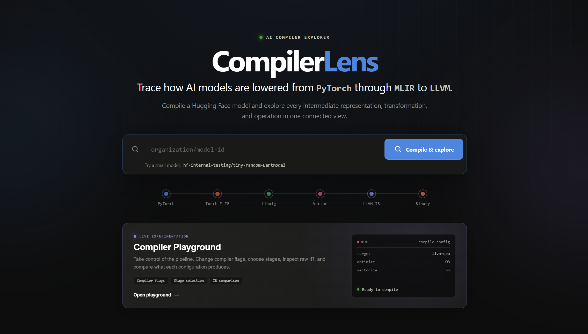
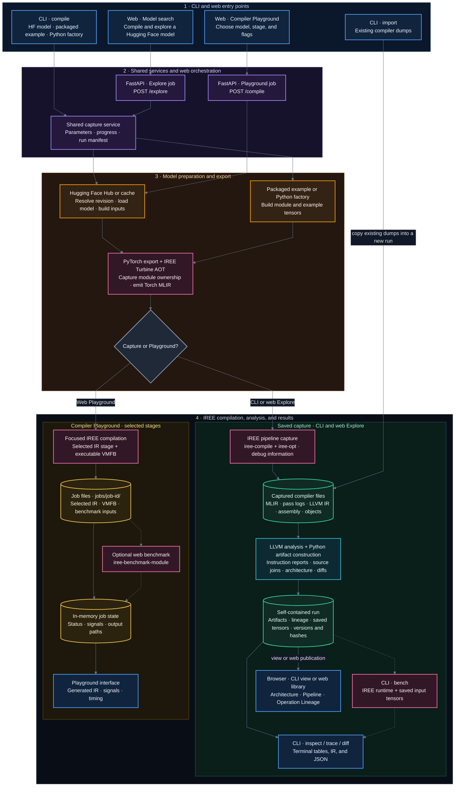
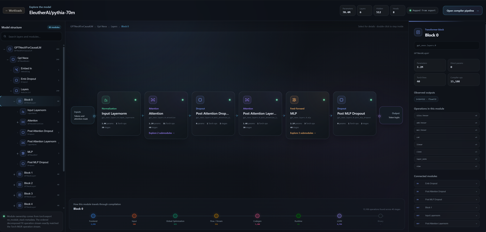
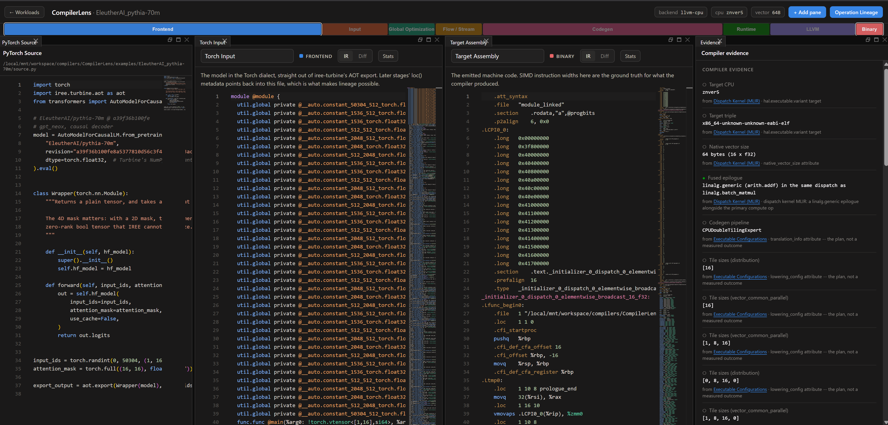
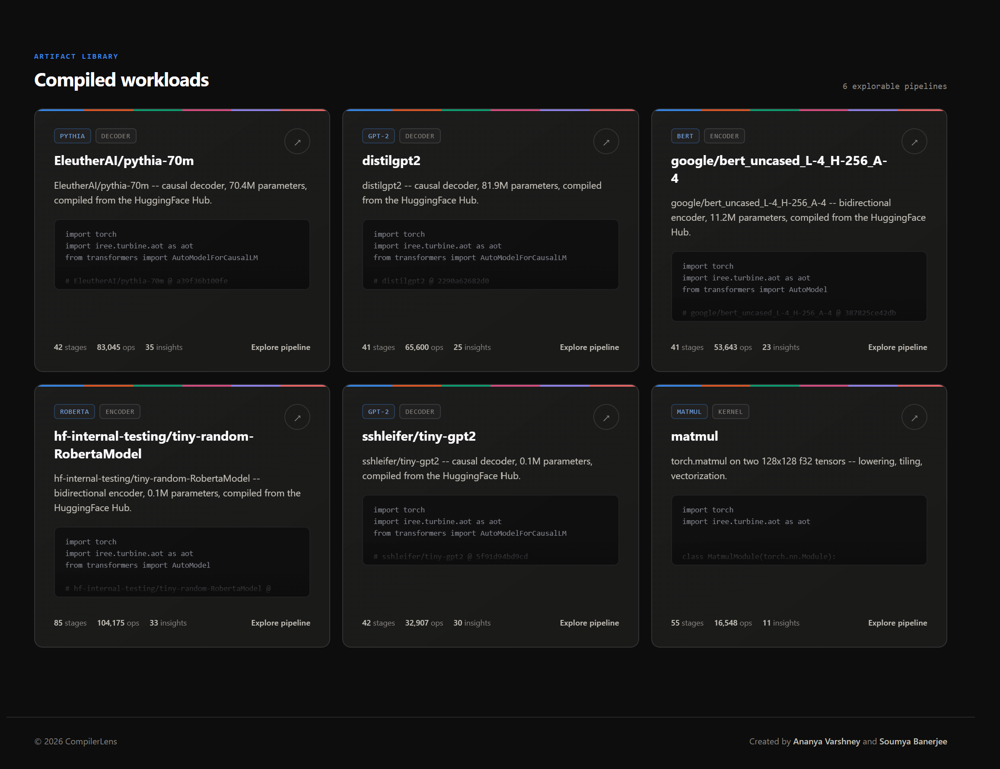

# CompilerLens

<p align="center">
  <a href="https://pypi.org/project/compilerlens/"></a>
  <a href="#system-requirements"></a>
  <a href="#system-requirements"></a>
  <a href="LICENSE"></a>
</p>

CompilerLens is an interactive explorer for AI compiler pipelines. It compiles a PyTorch or
Hugging Face model through IREE and presents the resulting Torch, MLIR, LLVM IR, and x86-64
stages in one navigable interface.

<p align="center">
  
</p>

<p align="center"><em>Search and compile Hugging Face models, follow the lowering path, or experiment in the Compiler Playground.</em></p>

## Table of Contents

- [Key Capabilities](#key-capabilities)
- [System Architecture and Repository Layout](#system-architecture-and-repository-layout)
- [System Requirements](#system-requirements)
- [CLI Quick Start](#cli-quick-start)
- [Installation from Source](#installation-from-source)
- [Running CompilerLens Locally](#running-compilerlens-locally)
- [Compiling Models from the Web Interface](#compiling-models-from-the-web-interface)
- [Supported Model Architectures](#supported-model-architectures)
- [Repository Compilation Script](#repository-compilation-script)
- [Compiler Playground and Benchmarking](#compiler-playground-and-benchmarking)
- [Validation and Testing](#validation-and-testing)
- [Troubleshooting](#troubleshooting)
- [Contributions](#contributions)
- [Citation](#citation)
- [License](#license)

## Key Capabilities

- A searchable timeline of compiler stages and passes
- An interactive model architecture map linked to the operations each module exports
- Side-by-side textual and semantic diffs
- Compiler evidence linked directly to the IR that produced it
- Compiler-recorded operation lineage from framework-level operations through LLVM IR and assembly
- Focused lineage IR: show every matching section, expand surrounding lines above/below,
  or switch to the full IR; the workload pipeline keeps its complete stage views
- A landing-page search flow that compiles a Hugging Face model and adds it as a workload
- A Compiler Playground for changing selected compiler options and benchmarking the result
- An installable CLI for capturing, inspecting, tracing, comparing, and benchmarking saved runs
- A bundled browser viewer for opening CLI captures without a separate frontend setup

## System Architecture and Repository Layout

CompilerLens separates model acquisition, compilation, artifact construction, and
visualization. The normalized artifact is the contract between the Python compiler pipeline and
the TypeScript frontend.

### End-to-end data flow


```mermaid
%%{init: {"theme":"base","themeVariables":{"background":"#080c12","primaryTextColor":"#e5e7eb","lineColor":"#64748b","fontFamily":"ui-monospace, SFMono-Regular, Menlo, monospace","clusterBkg":"#0b111b","clusterBorder":"#334155","edgeLabelBackground":"#111827"},"flowchart":{"curve":"linear","nodeSpacing":36,"rankSpacing":48}}}%%
flowchart TB
    subgraph Entry["1 · CLI and web entry points"]
        direction LR
        CLI["CLI · compile<br/>HF model · packaged example · Python factory"]
        Import["CLI · import<br/>Existing compiler dumps"]
        Search["Web · Model search<br/>Compile and explore a Hugging Face model"]
        Controls["Web · Compiler Playground<br/>Choose model, stage, and flags"]
    end

    subgraph Service["2 · Shared services and web orchestration"]
        direction LR
        Explore["FastAPI · Explore job<br/>POST /explore"]
        Shared["Shared capture service<br/>Parameters · progress · run manifest"]
        Compile["FastAPI · Playground job<br/>POST /compile"]
    end

    subgraph Preparation["3 · Model preparation and export"]
        direction TB
        Resolve["Hugging Face Hub or cache<br/>Resolve revision · load model · build inputs"]
        Local["Packaged example or Python factory<br/>Build module and example tensors"]
        Export["PyTorch export + IREE Turbine AOT<br/>Capture module ownership · emit Torch MLIR"]
        Mode{"Capture or Playground?"}

        Resolve --> Export
        Local --> Export
        Export --> Mode
    end

    subgraph Compilation["4 · IREE compilation, analysis, and results"]
        direction LR

        subgraph Persistent["Saved capture · CLI and web Explore"]
            direction TB
            Capture["IREE pipeline capture<br/>iree-compile + iree-opt · debug information"]
            Dumps[("Captured compiler files<br/>MLIR · pass logs · LLVM IR · assembly · objects")]
            Analyze["LLVM analysis + Python artifact construction<br/>Instruction reports · source joins · architecture · diffs"]
            Run[("Self-contained run<br/>Artifacts · lineage · saved tensors · versions and hashes")]
            Terminal["CLI · inspect / trace / diff<br/>Terminal tables, IR, and JSON"]
            SavedBenchmark["CLI · bench<br/>IREE runtime + saved input tensors"]
            Explorer["Browser · CLI view or web library<br/>Architecture · Pipeline · Operation Lineage"]

            Capture --> Dumps --> Analyze --> Run
            Run --> Terminal
            Run -->|view or web publication| Explorer
            Run -.-> SavedBenchmark -.-> Terminal
        end

        subgraph TemporaryPath["Compiler Playground · selected stages"]
            direction TB
            Selected["Focused IREE compilation<br/>Selected IR stage + executable VMFB"]
            Temporary[("Job files · jobs/job-id/<br/>Selected IR · VMFB · benchmark inputs")]
            JobState[("In-memory job state<br/>Status · signals · output paths")]
            Benchmark["Optional web benchmark<br/>iree-benchmark-module"]
            Results["Playground interface<br/>Generated IR · signals · timing"]

            Selected --> Temporary --> JobState --> Results
            Temporary -.-> Benchmark -.-> JobState
        end
    end

    CLI --> Shared
    Search --> Explore --> Shared
    Controls --> Compile
    Shared --> Resolve
    Shared --> Local
    Compile --> Resolve
    Import -->|copy existing dumps into a new run| Dumps
    Mode -->|CLI or web Explore| Capture
    Mode -->|Web Playground| Selected

    class CLI,Import,Search,Controls,Terminal,Explorer,Results ui
    class Explore,Shared,Compile api
    class Resolve,Local model
    class Export,Capture,Selected,Benchmark,SavedBenchmark compiler
    class Mode decision
    class Dumps,Run persistent
    class Temporary,JobState transient
    class Analyze analysis

    classDef ui fill:#10243e,stroke:#4f9cf9,color:#edf6ff,stroke-width:2px
    classDef api fill:#24183d,stroke:#9b87f5,color:#f4f0ff,stroke-width:2px
    classDef model fill:#332315,stroke:#f59e0b,color:#fff7ed,stroke-width:2px
    classDef compiler fill:#321827,stroke:#ec6fa5,color:#fff1f7,stroke-width:2px
    classDef decision fill:#202938,stroke:#94a3b8,color:#f8fafc,stroke-width:2px
    classDef persistent fill:#0f2b24,stroke:#34d399,color:#ecfdf5,stroke-width:2px
    classDef transient fill:#2c230e,stroke:#eabf4f,color:#fffbeb,stroke-width:2px
    classDef analysis fill:#0d2931,stroke:#35b9c9,color:#ecfeff,stroke-width:2px

    style Entry fill:#0b172a,stroke:#27496f,stroke-width:1px,color:#bfdbfe
    style Service fill:#17122b,stroke:#4c3b78,stroke-width:1px,color:#ddd6fe
    style Preparation fill:#24170f,stroke:#70451d,stroke-width:1px,color:#fed7aa
    style Compilation fill:#090e16,stroke:#334155,stroke-width:1px,color:#cbd5e1
    style Persistent fill:#0a1e1a,stroke:#1f6f58,stroke-width:1px,color:#a7f3d0
    style TemporaryPath fill:#1d180b,stroke:#735d16,stroke-width:1px,color:#fde68a
```

Blue nodes are user-facing CLI and browser surfaces; violet nodes coordinate work;
orange nodes prepare models; pink nodes execute compiler or runtime tools; teal nodes
analyze compiler output; green nodes store saved captures; amber nodes hold Playground
files and job state. Solid arrows show the main flow; dashed arrows show optional benchmarking.

The CLI and web model search use the same capture service:

1. Choose a Hugging Face model, or use a packaged example or local Python factory through the CLI.
2. Prepare the model and actual input tensors, resolve the model revision, and export through
   PyTorch and IREE Turbine while capturing model-module ownership.
3. Run IREE and retain MLIR stages, pass logs, LLVM snapshots, assembly, and object files.
4. Analyze LLVM snapshots with the C++ pass and join compiler source locations in Python.
   Build architecture mappings, operation lineage, diffs, and the browser artifact. See the
   [LLVM component guide](llvm/README.md) for the analysis details and coverage limits.
5. Save a self-contained run. CLI captures use `--out` or a fresh directory under
   `compilerlens-runs/`; web Explore uses `runs/<job-id>/` in the configured workspace.
6. Inspect or trace the saved run in the terminal, benchmark its captured inputs, or open it
   in the existing browser viewer with `compilerlens view`. Web Explore also publishes its
   artifact and workload entry to the browser library under `frontend/public/artifacts/`.

`compilerlens import` starts from existing dumps and builds a new analyzed run without
recompiling the model. The static developer workflow can also build browser artifacts from
existing dumps using `npm run artifact`.

The Compiler Playground exports the selected Hugging Face model and compiles requested stages
into `jobs/<job-id>/`. It exposes IR, compiler signals, and optional timings directly through
job state. Restarting the API loses that in-memory state; generated files remain on disk.
The saved-capture path retains artifacts that remain available in the workload library.

### Model architecture to compiler bridge

Each workload first opens an interactive module hierarchy. The explorer shows model facts,
parameter counts, observed tensor shapes, exported Torch operations, and compiler-stage
coverage. Selecting a module reveals where its operations survive across the lowering phases;
**Trace through compiler** opens that module's source operation directly in Operation Lineage.

<p align="center">
  
</p>

<p align="center"><em>Pythia 70M's transformer structure connected directly to its compiler-stage lineage.</em></p>

For newly compiled Hugging Face models, module ownership comes from `torch.export`'s
`nn_module_stack` metadata and is accepted only when the complete decomposed FX operation stream
matches the Torch MLIR stream. Older workloads without this sidecar receive a clearly labelled,
compiler-derived operation topology; CompilerLens does not invent layer ownership.

### Interactive pipeline workspace

Each compiled workload opens as a configurable workspace. Developers can inspect the original
PyTorch source beside any captured IR stage, follow the phase rail from frontend lowering to
binary output, compare representations, and trace compiler evidence back to the stage that
produced it.

<p align="center">
  
</p>

<p align="center"><em>The Pythia 70M pipeline viewed across framework source, compiler IR, target assembly, and evidence.</em></p>

### Artifact contract

Each workload is represented by one normalized JSON document containing:

- Model and compilation metadata
- Ordered compiler stages with complete IR text
- Operation summaries and histograms
- Track-aware stage diffs
- Compiler evidence with source-stage references
- Source-to-stage operation lineage
- Model hierarchy, tensor shapes, parameter counts, and module-to-compiler mappings
- Explicit notes for incomplete or unavailable compiler data

The Python schema is defined in `compilerlens/ingest/schema.py` and mirrored by
`frontend/src/api/artifact.ts`. A schema change must update both definitions and increment the
artifact version.

### Runtime modes

| Mode | Entry point | API required | Persistence | Primary purpose |
|---|---|---:|---|---|
| Static explorer | `npm run artifact` + `npm run dev` | No | Generated artifact files | Explore existing compiler dumps |
| Web model search | Model search field on the landing page | Yes | Dumps and artifact are retained | Add a Hugging Face model end to end |
| Compiler Playground | **Open the Compiler Playground** | Yes | Job files; status in memory | Test compiler options and selected stages |
| CLI capture and analysis | `compilerlens compile` / `import` / `inspect` / `trace` | No | Self-contained run directory | Capture, query, compare, and benchmark models |
| Bundled viewer | `compilerlens view RUN` | Started by the command | Reads saved runs | Explore CLI captures in the browser |
| Repository compilation script | `scripts/compile_hf_model.py` | No | Dumps under `examples/` | Generate dumps for the static developer workflow |

### Repository layout

```text
CompilerLens/
├── compilerlens/                Installable Python implementation
│   ├── cli.py                  compile/import/inspect/trace/diff/bench/view/doctor
│   ├── services.py             Shared capture and import orchestration
│   ├── lineage.py              LLVM report processing and source/assembly joins
│   ├── queries.py              Queries over saved runs
│   ├── storage.py              Durable run files and workspace selection
│   ├── server.py               Serve the bundled viewer and API
│   ├── backend/                API, IREE compiler runner and benchmarking
│   ├── models/                 Hugging Face detection, loading and architecture capture
│   ├── ingest/                 Artifact construction, parsers and operation lineage
│   └── examples/               Packaged matmul, linear/ReLU and transformer examples
├── llvm/                       C++ LLVM analysis, plugin, driver, tests and IREE hook
├── backend/, models/, ingest/  Compatibility imports for checkout commands
├── frontend/                   React viewer, build configuration and browser checks
├── scripts/                    Legacy model compiler, release build and install checks
├── docs/                       CLI guide, release checklist and screenshots
├── examples/                   Existing fixtures and legacy script output
├── runs/                       Generated CLI/web captures (not tracked)
├── tests/                      Python regression tests
├── pyproject.toml              Package metadata and runtime dependencies
├── requirements.txt            Pinned development environment
└── README.md                   Project overview and setup
```

## System Requirements

- Linux x86-64; the tested package wheel requires glibc 2.35 or newer
- Python 3.10 is the validated interpreter
- Internet access for installation and uncached Hugging Face models
- Enough disk space for compiler dumps; even small models can produce tens or hundreds of MB
- For frontend development from source: Node.js 20.19+ or 22.12+; Node 22 is recommended

The package includes the IREE compiler/runtime dependencies and a prebuilt LLVM analyzer.
The installed CLI and bundled viewer do not require Node.js, CMake, or an LLVM SDK.
Source installation builds our LLVM pass. The [Miniconda setup below](#installation-from-source)
provides Python, Node.js, CMake, Ninja, a C++ compiler and LLVM in one user-local environment;
no sudo or separately installed LLVM/CMake is needed.

## CLI Quick Start

Use the installed CLI to capture a model, inspect its compiler stages, and open the same
browser viewer. A repository checkout is not required.

### Create an environment and install

This quick start targets **0.2.1** on Linux x86-64 with glibc 2.35+; Python 3.10 is
the validated interpreter. See the [release checklist](docs/RELEASING.md) for publication
status. Version 0.2.1 is published on PyPI and includes the CLI, native analyzer and webpage.

```bash
mkdir compilerlens-demo
cd compilerlens-demo
python3.10 -m venv .venv
source .venv/bin/activate
python -m pip install --upgrade pip

# Install CompilerLens from PyPI, using CPU builds of PyTorch.
python -m pip install \
  --index-url https://pypi.org/simple/ \
  --extra-index-url https://download.pytorch.org/whl/cpu \
  compilerlens==0.2.1

python -m pip check
compilerlens doctor
```

The PyTorch CPU index supplies CPU builds for the supported workflow. CompilerLens itself
comes from PyPI. See the [release notes](docs/releases/0.2.1.md) for compatibility and
the [release checklist](docs/RELEASING.md) for validation details.

### Compile, inspect, and open the viewer

Start with the packaged matmul example, which needs no Hugging Face model download:

```bash
compilerlens compile --example matmul --out runs/matmul --lineage required
compilerlens inspect runs/matmul
compilerlens inspect runs/matmul --show stages
compilerlens trace runs/matmul --module model --to asm
compilerlens view runs/matmul --port 8000
```

Open `http://127.0.0.1:8000` to explore the captured model architecture, compiler pipeline,
and operation lineage. Stop the viewer with Ctrl+C. Choose a new output directory for each
capture; CompilerLens refuses to overwrite an existing run.
If CompilerLens is running on a remote SSH server, use the
[SSH tunnel instructions below](#viewing-from-a-remote-ssh-server) to open it on your computer.

To capture a Hugging Face model:

```bash
compilerlens compile sshleifer/tiny-gpt2 --seq-len 8 --out runs/tiny-gpt2
```

### Viewing from a remote SSH server

Use **SSH tunneling (local port forwarding)** to reach the remote viewer from your own
computer. `127.0.0.1` refers to the machine where it is used: opening that address in your
local browser does not directly connect to the remote server.

1. On the **remote server**, start the viewer and leave it running:

   ```bash
   compilerlens view runs/matmul --port 8000
   ```

2. In a separate terminal on **your own computer**, start the tunnel:

   ```bash
   ssh -N -L 8001:127.0.0.1:8000 username@remote-host
   ```

   Replace `username@remote-host` with your usual SSH destination or configured SSH alias.
   This forwards local port `8001` to port `8000` on the remote server.

3. Open **http://127.0.0.1:8001** in your computer's browser to view the saved run.

Keep both the viewer and SSH tunnel running while using the webpage; Ctrl+C stops each
process. If local port `8001` is occupied, choose another local port in the tunnel command
and browser URL. `--open` attempts to launch a browser on the machine running CompilerLens;
it does not open your local browser through SSH.

### Primary commands

| Command | Purpose |
|---|---|
| `compilerlens doctor` | Check compiler tools, the LLVM analyzer, and bundled viewer assets |
| `compilerlens compile` | Capture a Hugging Face model, packaged example, or local Python factory |
| `compilerlens import DUMPS --out RUN` | Turn existing compiler dumps into a saved run |
| `compilerlens inspect RUN` | Inspect architecture, stages, evidence, operations, IR, or object sections |
| `compilerlens trace RUN` | Follow module/source associations into LLVM and assembly, or query them in reverse |
| `compilerlens diff RUN --from STAGE --to STAGE` | Compare compatible stages within a run |
| `compilerlens bench RUN` | Benchmark with the saved input tensors |
| `compilerlens view RUN` | Serve the saved run in the bundled browser viewer |

See the **[detailed CLI guide](docs/CLI.md)** for selectors, JSON output, offline capture,
local Python factories, object-address lookup, and build instructions. The
[release checklist](docs/RELEASING.md) records PyPI validation and publication steps.
Version `0.2.1` adds ViT/CLIP capture and offline vision demos, while retaining the
existing CLI commands and the ability to read saved runs from versions `0.1.0` and `0.1.1`.

## Installation from Source

This path builds the Python/frontend application **and our native LLVM pass** from the
checkout. For the prebuilt application, use the [PyPI quick start](#cli-quick-start).

Use **Linux x86-64 with glibc 2.35+** (for example, Ubuntu 22.04), internet access, and
several GB of free disk space. No sudo or GPU is required. [environment.yml](environment.yml)
provides Python 3.10, LLVM 22.1.8, the C/C++ build tools and Node.js 22; `requirements.txt`
provides the Python packages. Conda replaces the separate venv for source development.

### 1. Install Miniconda once

Skip installation if you already have Conda. Otherwise, install it under your own account:

```bash
curl -fsSLo /tmp/compilerlens-miniconda.sh \
  https://repo.anaconda.com/miniconda/Miniconda3-latest-Linux-x86_64.sh
bash /tmp/compilerlens-miniconda.sh -b -p "$HOME/miniconda3"
source "$HOME/miniconda3/etc/profile.d/conda.sh"
```

If curl is unavailable, download that installer using a browser. In new terminals, repeat
the `source` command to enable `conda activate` (adjust the path for an existing installation).
If a Python venv is currently active, run `deactivate` before activating Conda.

### 2. Create the development environment

From the root of your updated CompilerLens checkout:

```bash
CONDARC="$PWD/.condarc" conda env create -f environment.yml
conda activate compilerlens-dev
python -m pip install -r requirements.txt
python -m pip check
```

The project-local `.condarc` selects conda-forge without changing global Conda settings.
The environment excludes unrelated user-site Python packages. Do not create another venv
or install CompilerLens from PyPI inside this environment.
If you do not have the checkout or Git yet, use GitHub's **Code → Download ZIP** on the
branch or release tag you want to use and extract it first; the environment also installs
Git for later use.

### 3. Build the pass and prepare the webpage

From the repository root with `compilerlens-dev` active:

```bash
cmake -S llvm -B build/llvm-conda -G Ninja \
  -DLLVM_DIR="$CONDA_PREFIX/lib/cmake/llvm" \
  -DPython3_EXECUTABLE="$CONDA_PREFIX/bin/python" \
  -DCMAKE_BUILD_TYPE=Release
cmake --build build/llvm-conda --parallel 2
ctest --test-dir build/llvm-conda --output-on-failure
export COMPILERLENS_NATIVE="$PWD/build/llvm-conda/compilerlens-native"
"$COMPILERLENS_NATIVE" --version

cd frontend
npm ci
npm run artifact -- --lineage required
cd ..
```

Conda activation selects the environment's compiler; `$CONDA_PREFIX` locates its LLVM SDK.
The separate `build/llvm-conda/` directory avoids old system-toolchain CMake caches.
CTest should pass, and artifact generation should report `Lineage: native`.
Use `--parallel 1` if the native build runs out of memory. Keep the Conda environment active
when running the analyzer: it uses libraries from that environment.

Artifact generation updates the existing `examples/` workloads using their saved dumps,
without recompiling models or modifying original LLVM files. Repeat the build after C++
changes, then repeat `npm run artifact -- --lineage required` from `frontend/` and refresh
the page. Native reports go into each workload's `native/` directory, mappings into
`lineage.json`, and viewer JSON into `frontend/public/artifacts/`.
Separate CLI captures under `runs/` are not automatically included.

Lineage links source operations to LLVM and assembly instructions. `required` fails if native
analysis is unavailable or fails. Plain `npm run artifact` uses Automatic with fallback;
`npm run artifact -- --lineage off` skips native analysis. New Web Explore compilations
automatically use native analysis when available, with fallback if it is unavailable or
fails; viewing saved workloads does not rerun analysis. Missing compiler source locations
can still leave instructions unlinked.

## Running CompilerLens Locally

After completing the source installation above, start the API from the repository root:

```bash
conda activate compilerlens-dev
export COMPILERLENS_NATIVE="$PWD/build/llvm-conda/compilerlens-native"
python -m backend.api.run_server
```

In a second terminal, start the frontend:

```bash
conda activate compilerlens-dev
cd frontend
npm run dev
```

Open the **Local** URL printed by Vite after `npm run dev` (for example,
`http://localhost:5173`). Vite may choose a different port when 5173 is already occupied.
Keep both processes running while using model search or the Compiler Playground. The existing,
pre-generated workload viewer only needs the frontend.

When running this source-development setup on a remote SSH server, start both processes
there, then forward the frontend and API ports from a terminal on **your own computer**:

```bash
ssh -N -L 5173:127.0.0.1:5173 -L 8000:127.0.0.1:8000 username@remote-host
```

Replace the SSH destination with your own and open `http://127.0.0.1:5173` locally.
Use Vite's actual remote port if it selected a different one. Keep local port `8000`
forwarded for model search and the Compiler Playground, which use the API on that port.
For the installed CLI viewer, use the [single-port tunnel above](#viewing-from-a-remote-ssh-server).

If port 8000 is already in use, an API server is probably running in another terminal. Reuse
that process or stop it before starting another one.

## Compiling Models from the Web Interface

1. Open the landing page.
2. Enter a Hugging Face repository ID in the prominent model search field.
3. Select **Compile & explore** or press Enter.

The API downloads the model, exports it through Turbine, captures the model hierarchy and
compiler stages, creates the normalized artifact, updates the landing-page index, and opens the
new architecture explorer. From there, select a module to inspect its compiler coverage, trace
one of its operations, or open the complete pipeline.

Successful compilations are added to the artifact library, where every card summarizes the
model family, architecture type, stage count, operation count, and available compiler insights.

<p align="center">
  
</p>

<p align="center"><em>Compiled workloads remain available as explorable pipeline artifacts.</em></p>

Good small models to try:

```text
hf-internal-testing/tiny-random-BertModel
hf-internal-testing/tiny-random-DistilBertModel
sshleifer/tiny-gpt2
prajjwal1/bert-tiny
```

The web flow currently accepts models below 100 million parameters. Compatibility depends on
whether the installed PyTorch, Transformers, and IREE versions can export every operation in
the model.

## Supported Model Architectures

The CLI, Web Explore, Playground, and source scripts share the same model adapters:

| Family | Captured forward pass |
|---|---|
| Text encoders (BERT-like) | Token IDs + mask → hidden states |
| Causal text models (GPT-like) | Token IDs + mask → logits; no generation loop |
| ViT | Image tensor → hidden states; classification head excluded |
| CLIP | Image + text → embeddings and similarity logits |

Support covers the forward passes shown; tested checkpoints are listed below.
Compatibility with other checkpoints may vary.

Pretrained models to try with ViT/CLIP support (source installation or the 0.2.1 wheel):

- [`google/vit-base-patch16-224`](https://huggingface.co/google/vit-base-patch16-224) — 85.8M-parameter image encoder; tested through Web Explore. Captures patch embeddings and transformer blocks, not the classification head.
- [`wkcn/TinyCLIP-ViT-8M-16-Text-3M-YFCC15M`](https://huggingface.co/wkcn/TinyCLIP-ViT-8M-16-Text-3M-YFCC15M) — 23.45M parameters; validated image/text encoders, embeddings, and similarity logits.

Paste either ID into the search bar or pass it to `python -m compilerlens compile MODEL_ID`.
Validation uses static, batch-one CPU/float32 workloads with synthetic inputs. Audio,
other multimodal families, encoder-decoder models, and real-media preprocessing remain future work.

Try the offline demos from the repo root with your source environment active
(random weights; no downloads or extra dependencies):

```bash
python -m compilerlens compile --example tiny_vit --out examples/tiny_vit
python -m compilerlens compile --example tiny_clip --out examples/tiny_clip
cd frontend
npm run artifact
```

Refresh the [source webpage](#running-compilerlens-locally); use fresh output paths if these
directories exist. These demos require `0.2.1` or the current source checkout. Native lineage remains automatic;
ViT/CLIP captures on host/generic CPU also compare compiled outputs with PyTorch and save
`verification.json`. See the [CLI guide](docs/CLI.md#validated-hf-checkpoints) for pinned revisions and validation commands.

## Repository Compilation Script

For the installed package, use the [CLI quick start](#cli-quick-start). The repository also
provides a developer script for generating dumps and rebuilding the static artifact library:

```bash
conda activate compilerlens-dev
export COMPILERLENS_NATIVE="$PWD/build/llvm-conda/compilerlens-native"
python scripts/compile_hf_model.py prajjwal1/bert-tiny --seq-len 16
cd frontend
npm run artifact
```

Useful options:

```bash
python scripts/compile_hf_model.py MODEL_ID --dry-run
python scripts/compile_hf_model.py MODEL_ID --revision COMMIT_SHA
python scripts/compile_hf_model.py MODEL_ID --out-dir /path/to/output
python scripts/compile_hf_model.py MODEL_ID --full
python -m models.prefetch MODEL_ID [MODEL_ID ...]
```

`--full` disables dump trimming and can generate several GB of data. The default mode retains
the stages needed by the UI while removing embedded weight payloads and redundant pass dumps.

## Compiler Playground and Benchmarking

Choose **Open the Compiler Playground** from the landing page to:

- Compile selected stages
- Compare allowlisted compiler options such as target CPU and optimization level
- Inspect the resulting IR and compiler signals
- Run an explicit whole-model benchmark

The model selector combines a small set of baseline models with persisted captures found under
`examples/*/model_info.json` and `runs/*/model_info.json`. Reopening the Playground refreshes this list,
so models added through landing-page search or the command-line compiler appear automatically.

Playground jobs are stored in memory and disappear when the API restarts. Hugging Face models
compiled through landing-page search are persisted under `runs/<job-id>/`, with viewer artifacts
published to `frontend/public/artifacts/`. Installed builds use the user cache workspace by
default; `COMPILERLENS_WORKSPACE` overrides it.

## Validation and Testing

Run the backend syntax checks and frontend production build:

```bash
conda activate compilerlens-dev
export COMPILERLENS_NATIVE="$PWD/build/llvm-conda/compilerlens-native"
python -m py_compile compilerlens/backend/api/app.py compilerlens/backend/api/run_server.py compilerlens/ingest/build.py compilerlens/ingest/schema.py compilerlens/models/architecture.py compilerlens/ingest/architecture.py
python -m unittest discover -s tests -v

cd frontend
npm test
npm run build
```

For browser-level checks, leave `npm run dev` running and execute:

```bash
cd frontend
npx playwright install chromium   # first run only
npm run verify
npm run verify:lineage   # isolated fixtures; no model downloads or saved workloads required
```

## Troubleshooting

- Remote viewer starts but the browser cannot connect: follow the
  [SSH tunnel instructions](#viewing-from-a-remote-ssh-server), open the local forwarded URL,
  and keep both the viewer and tunnel running.
- `iree-compile not found`: activate `compilerlens-dev` for source development, or `.venv`
  for the PyPI quick start, before starting the API or compiler script.
- API unavailable in the UI: confirm `python -m backend.api.run_server` is listening on port
  8000.
- Hugging Face download failure: check the model ID, network access, authentication for gated
  repositories, and available disk space.
- Export or compilation failure: the architecture may use PyTorch operations unsupported by
  the current IREE pipeline. The API terminal contains the detailed compiler traceback.
- Frontend has no workloads: run `cd frontend && npm run artifact`.

## Contributions

Contributions are welcome. Create a focused branch, follow the installation instructions, and
run the relevant validation before opening a pull request:

```bash
cd frontend
npm run build
npm run verify   # requires the Vite development server and Playwright Chromium
```

For compiler or backend changes, also run the Python syntax checks listed in
[Validation and Testing](#validation-and-testing). Please include a concise description of the
change, testing performed, and screenshots for visible UI changes.

## Citation

If CompilerLens is useful in your work, please cite:

```bibtex
@software{compilerlens2026,
  author = {Varshney, Ananya and Banerjee, Soumya},
  title = {CompilerLens: An Interactive AI Compiler Visualization Explorer},
  year = {2026}
}
```

## License

CompilerLens is available under the Apache License 2.0. See [LICENSE](LICENSE) for the complete
terms.
